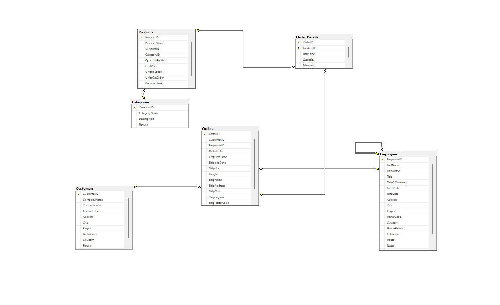

# 🗄️ SQL & Database Study Library

This repository contains queries, database designs, and complex T-SQL examples developed during my SQL learning journey. It is created both as a guide for beginners and to track my own progress.

### 🗺️ Database Architecture (ER Diagram)

---

### 🚀 Table of Contents
- 📚 **SQL Cheat Sheet:** A comprehensive reference guide covering fundamental to advanced SQL commands (SELECT, JOINS, DDL, CTEs, Window Functions).
- 📊 **Basic Queries:** Usage of `SELECT`, `WHERE`, and `ORDER BY`.
- 🔗 **Table Joins:** Scenarios for `INNER JOIN`, `LEFT JOIN`, and `RIGHT JOIN`.
- 🛠️ **Data Management:** `INSERT`, `UPDATE`, and `DELETE` operations.
- 🧠 **Advanced SQL:** Examples of `Stored Procedures`, `Triggers`, and `Views`.
- 🗃️ **Project Applications:** Northwind samples and custom database blueprints.
- 🔌 **Backend Integration:** Guide on connecting to SQL Server via C# (.NET) and Node.js.
- 🛠️ **Advanced Level:** Examples of automated inventory tracking (Trigger) and dynamic reporting (Stored Procedure).

---

### 🛠️ Advanced Scenarios
* **Automation:** `TR_UpdateStock` trigger structure designed for inventory tracking.
* **Reporting:** `SP_GetYearlyReport` procedure for extracting annual sales analytics.
* **Security:** User authorization and Role-Based Access Control (RBAC) examples.

---

### 🛠️ Tech Stack

  
  
  

---

### 📖 How to Use
1. You can **Fork** this repository using the button in the top right corner.
2. Run the `.sql` files within the folders in any SQL editor (SSMS, Azure Data Studio, etc.).
3. Develop your own queries based on the provided sample scenarios.

---

### ⭐ Support
If these examples helped you or if you'd like to support my development, don't forget to leave a **Star**! Every star is a new source of motivation. 🚀

---

  <i>"Data is the new oil, and SQL is the refinery that processes it."</i>

---
---

# 🗄️ SQL ve Veritabanı Çalışma Kitaplığı

Bu depo, SQL öğrenme sürecimde geliştirdiğim sorguları, veritabanı tasarımlarını ve karmaşık T-SQL örneklerini içermektedir. Hem başlangıç seviyesindeki dostlarıma rehber olması hem de kendi gelişimimi takip etmek için oluşturulmuştur.

### 🗺️ Veritabanı Mimarisi (ER Diyagramı)

---

### 🚀 İçerik Başlıkları
- 📚 **SQL Komutları Sözlüğü:** Temelden ileri seviyeye (SELECT, JOINS, DDL, CTE, Window Functions) devasa başvuru rehberi eklendi.
- 📊 **Temel Sorgular:** `SELECT`, `WHERE`, `ORDER BY` kullanımı.
- 🔗 **Tablo Birleştirme:** `INNER JOIN`, `LEFT JOIN` ve `RIGHT JOIN` senaryoları.
- 🛠️ **Veri Yönetimi:** `INSERT`, `UPDATE`, `DELETE` işlemleri.
- 🧠 **İleri Seviye:** `Stored Procedures`, `Triggers` ve `Views` örnekleri.
- 🗃️ **Proje Uygulamaları:** Northwind ve özel veritabanı taslakları.
- 🔌 **Backend Entegrasyonu:** C# (.NET) ve JavaScript (Node.js) ile SQL Server bağlantı rehberi eklendi.
- 🛠️ **İleri Seviye:** Otomatik stok takibi (Trigger) ve dinamik raporlama (Stored Procedure) örnekleri eklendi.

---

### 🛠️ Gelişmiş Senaryolar
* **Otomasyon:** Stok takibi için hazırlanan `TR_UpdateStock` Trigger yapısı.
* **Raporlama:** Yıllık satış analizlerini çıkaran `SP_GetYearlyReport` Procedure örneği.
* **Güvenlik:** Kullanıcı yetkilendirme ve Role-based erişim örnekleri.

---

### 🛠️ Kullanılan Teknolojiler

  
  
  

---

### 📖 Nasıl Kullanılır?
1. Bu depoyu sağ üstten **Fork**'layabilirsiniz.
2. Klasörlerin içindeki `.sql` dosyalarını herhangi bir SQL editöründe (SSMS, Azure Data Studio vb.) çalıştırabilirsiniz.
3. Örnek senaryolar üzerinden kendi sorgularınızı geliştirebilirsiniz.

---

### ⭐ Destek Olun
Eğer buradaki örnekler işinize yaradıysa veya gelişimimi desteklemek isterseniz, sağ üst köşeden bir **Yıldız (Star)** bırakmayı unutmayın! Her yıldız yeni bir motivasyon kaynağıdır. 🚀

---

  <i>"Veri, yeni dünyada petroldür; SQL ise onu işleyen rafineri."</i>

